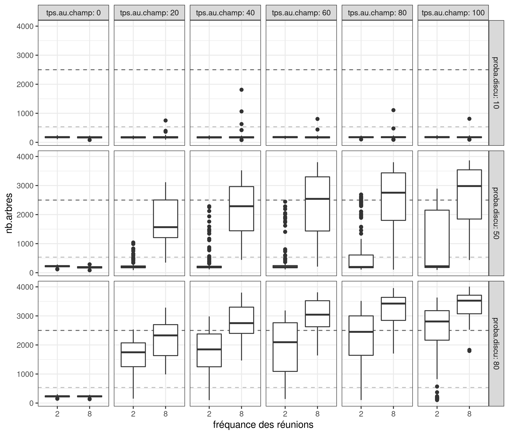
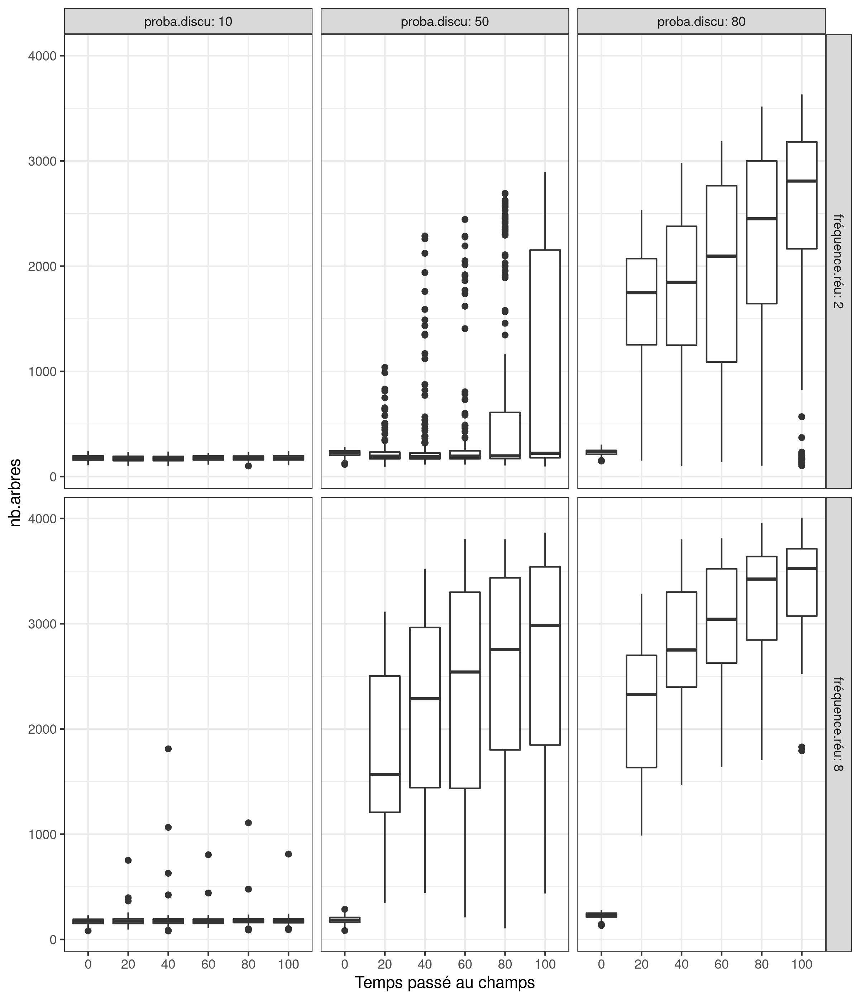

# real-tree-model
 ebauche du modèle: M0 = effet de la présence des arbres sur les rendements mil/arachide 
Implémentation 1: génération des arbres avec une répartition semi-aléatoire avec une contrainte d'éloignement minimum 

**Question sci** : combien de surveillant dans un senario centralisé pour atteindre un résultat avec le minimum de présence au champs dans un scénario de surveillance communautaire.

## Analyse de saltelli 

Il semble que les paramètres d'entré `probaDenonce` et `qPrésenceBrousse`, n'ait que très peut d'importance sur le modèle.

| output      | probaDiscu         | probaDenonce        | fréquenceRéu        | qPrésenceBrousse    | tpsAuChamp          |
|-------------|--------------------|---------------------|---------------------|---------------------|---------------------|
| om_trees    | 0.654672301452166  | 0.12426939894254287 | 0.23532599626506415 | 0.06112936082354896 | 0.25950574210586974 |
| om_stockMil | 0.6678387067443559 | 0.08886833119924557 | 0.28145057779243327 | 0.05195834767055857 | 0.17885987404164297 |

Par ordre d'importance on aurai `probaDiscu`, `tpsAuChamp` et `fréquenceRéu`

## boxplot de l'exploration 1

### DOTO
Il semble que ce soit pertinant de relancé des exploration pour des valeur de probabilité de discussion entre 10 et 50

