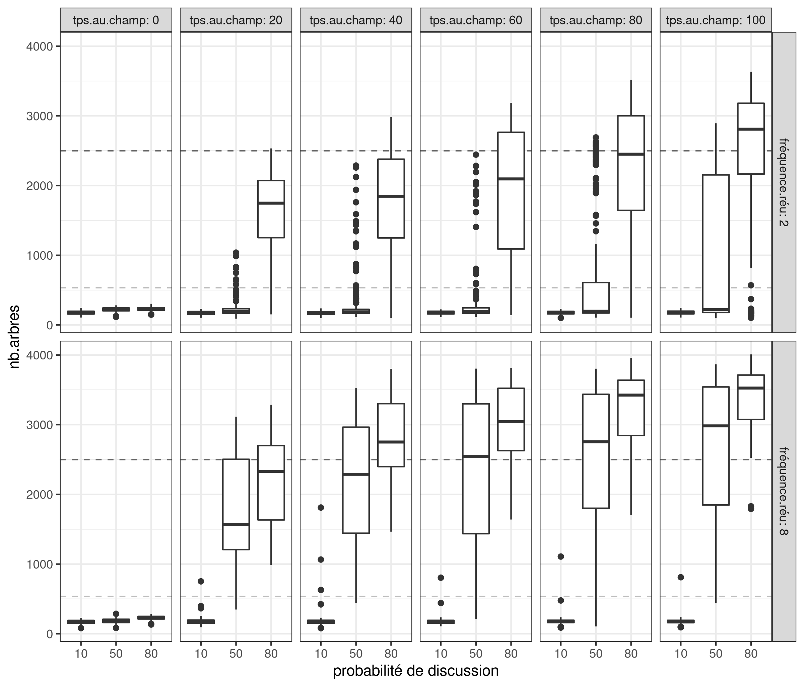
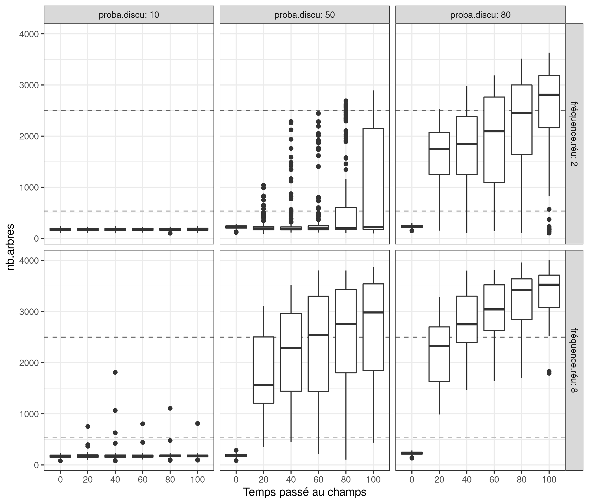
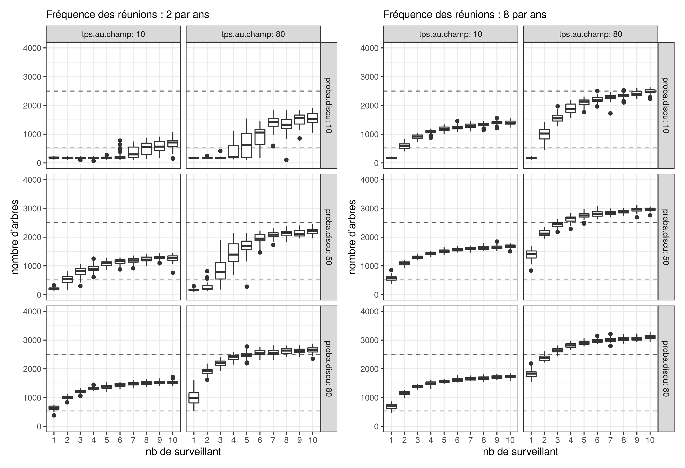

# real-tree-model
 ebauche du modèle: M0 = effet de la présence des arbres sur les rendements mil/arachide 
Implémentation 1: génération des arbres avec une répartition semi-aléatoire avec une contrainte d'éloignement minimum 

**Question sci** : combien de surveillant dans un senario centralisé pour atteindre un résultat avec le minimum de présence au champs dans un scénario de surveillance communautaire.

## Explo 1
### Analyse de saltelli explo 1

Il semble que les paramètres d'entré `probaDenonce` et `qPrésenceBrousse`, n'ait que très peut d'importance sur le modèle.

| output      | probaDiscu         | probaDenonce        | fréquenceRéu        | qPrésenceBrousse    | tpsAuChamp          |
|-------------|--------------------|---------------------|---------------------|---------------------|---------------------|
| om_trees    | 0.654672301452166  | 0.12426939894254287 | 0.23532599626506415 | 0.06112936082354896 | 0.25950574210586974 |
| om_stockMil | 0.6678387067443559 | 0.08886833119924557 | 0.28145057779243327 | 0.05195834767055857 | 0.17885987404164297 |

Par ordre d'importance on aurai `probaDiscu`, `tpsAuChamp` et `fréquenceRéu`

### boxplot de l'exploration 1

### DOTO
Il semble que ce soit pertinant de relancé des exploration pour des valeur de probabilité de discussion entre 10 et 50

## Explo 2

On est dans le cas d'une surveillance délégué (au moins en partie) a des surveillant spacialisé

### Analyse de saltelli explo2

| output      | nbSurveillants      | probaDiscu          | fréquenceRéu     | tpsAuChamp         |
|-------------|---------------------|---------------------|--------------------|--------------------|
| om_trees    | 0.3777680541425134  | 0.32698960635771984 | 0.2161186747863557 | 0.5075202964454291 |
| om_stockMil | 0.33896280852662614 | 0.3790204013802702  | 0.2646585049356692 | 0.4274414759075179 |

Il semble que tout les paramêtres jouent un rôle dans le ce cas là

### boxplot de l'exploration 2

En conparant, la seconde figure de l'explo 1, et celle-ci, il semble qu'il y ait un vrai effet de la surveillance quand le nombre de réunion est bas, et que les population locales ne passe que peut de temps aux champs pendant la saison sèche. 

Les surveillants (a partir de 4), on un effet imédiat sur le nombre d'arbre en fin de simulation bien que le nombre de réunion reste bas (2 réunion par ans) et quelque soit la probabilité de discission. 

Mais il semble aussi que le temps passé au champs en saison sèche permettent d'augmenter le nombre absolut d'arbre en fin de simulation.

## PSE

J'ai fait tourné un PSE sur deux observables de la viabilité (les récoltes de mil et le bois de chauffe). 

voilà le résultat

Il y a un beau domaine de validité (toutes les zones qui sont ateignable par le modèle), il faudrait maintenant convertire les valeurs que les acteurs nous ont donné en atelier en valeur de model (e.g. ramener a la population) pour faire apparaitre les limite de viabilité de la zone. 